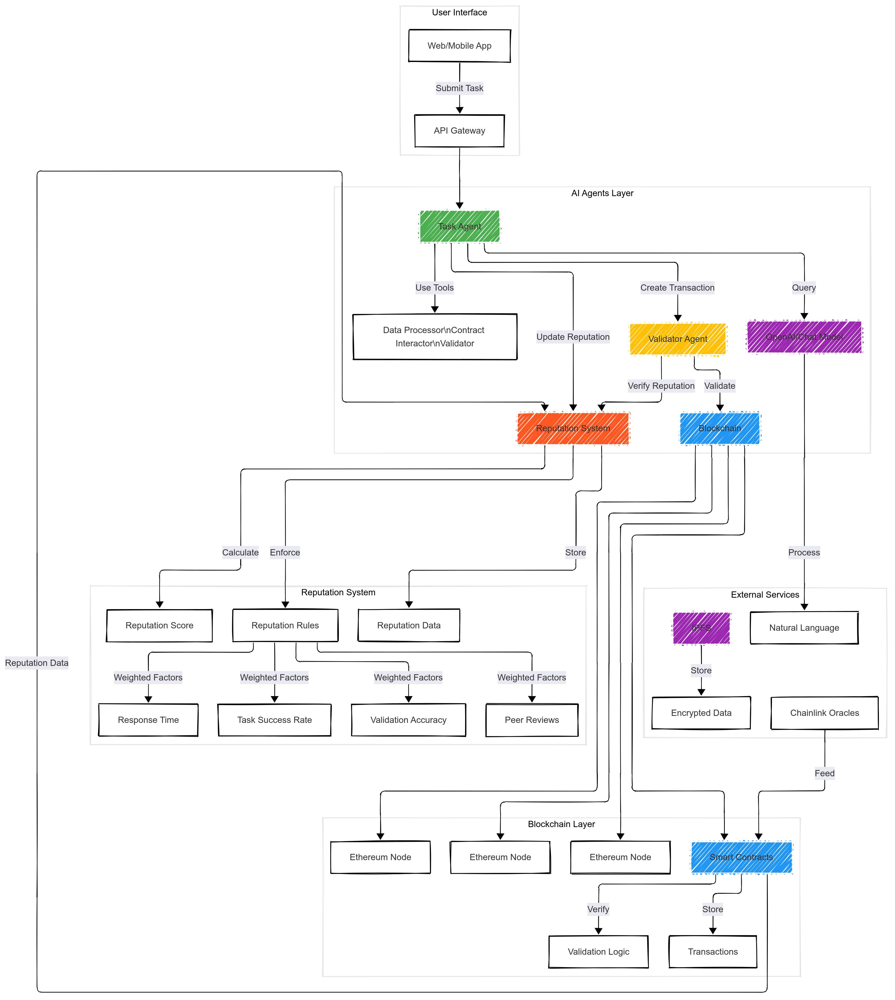

# ChainSecAI
# Secure AI Agent Transactions using Blockchain Technology

## Table of Contents

- [Introduction](#introduction)
- [Setup](#setup)
- [Usage](#usage)
- [Features](#features)
- [Roadmap](#roadmap)
- [Contributing](#contributing)
- [License](#license)

## Introduction

This repository provides a foundation for building secure AI agent interactions using blockchain technology. It enables immutable transaction logging, cryptographic security, smart contract validation, and decentralized agent interaction.


## Architecture




## Setup

To get started, follow these steps:

1. Install the required dependencies by running the following command:

```bash
pip install langchain openai web3 python-dotenv
```

2. Set up an Ethereum node, such as Ganache, to serve as the blockchain network.

3. Configure the environment variables by creating a `.env` file in the root directory of the project and adding the following content:

```env
OPENAI_API_KEY=your_key
WEB3_PROVIDER_URI=http://localhost:8545
```

## Usage

To use this repository, follow these steps:

1. Import the necessary modules in your Python script:

```python
from src.blockchain.core import Blockchain
from src.agents.task_agent import TaskAgent
```

2. Initialize the blockchain:

```python
blockchain = Blockchain()
```

3. Create AI agents:

```python
task_agent = TaskAgent(blockchain)
```

4. Execute a task:

```python
result = task_agent.execute_task("Process this data: {sample: 123}")
print(result)
```

## Features

This repository offers the following features:

- Immutable transaction logging: All transactions made by the AI agents are recorded on the blockchain, ensuring transparency and accountability.

- Cryptographic security: The use of blockchain technology provides cryptographic security, making it difficult for malicious actors to tamper with the data.

- Smart contract validation: The smart contracts used in this repository are validated to ensure their integrity and reliability.

- Decentralized agent interaction: The AI agents interact with each other in a decentralized manner, eliminating the need for a central authority.

## Roadmap

The future development of this repository includes the following milestones:

- Add support for multiple blockchain networks: Extend the functionality to support different blockchain networks, providing more flexibility for users.

- Implement zero-knowledge proofs for private transactions: Enhance privacy by implementing zero-knowledge proofs for private transactions.

- Add agent reputation system: Introduce a reputation system for AI agents to establish trust and reliability.

- Develop governance mechanisms: Implement governance mechanisms to ensure the smooth operation of the AI agent ecosystem.

- Create visualization tools for transaction history: Develop tools to visualize the transaction history on the blockchain, making it easier to analyze and understand.

## Contributing

Contributions to this repository are welcome. If you have any ideas or suggestions, feel free to open an issue or submit a pull request.

## License

This repository is licensed under the [MIT License](LICENSE).

Let me know if you need any further assistance!